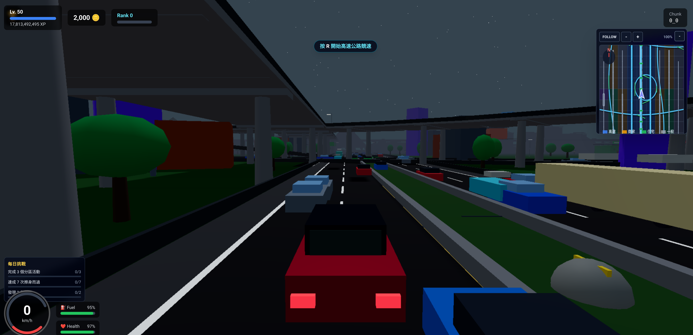

# Highway Adventure 3D

[](./public/screenshot.png)

Highway Adventure 3D is a high-octane, browser-based 3D driving and RPG exploration game. Built with **Three.js** and **React Three Fiber**, it features an infinite procedurally generated world where players can drive, explore various zones, complete quests, and upgrade their vehicles.

## 🚀 Key Features

- **Infinite Procedural World:** Seamlessly streamed world chunks featuring Highways, City Centers, Suburban Areas, and Industrial Zones.
- **Advanced Traffic AI:** Intelligent AI vehicles that follow lanes, change lanes, and react to the player's presence.
- **RPG & Quest System:** Interact with NPCs to take on varied missions, from high-speed deliveries to drift challenges.
- **Dynamic Environment:** Full day-night cycle and weather system that affects lighting and atmosphere.
- **Shop & Garage Systems:** Visit shops to buy items and head to the garage to upgrade performance or customize your vehicle's appearance.
- **Performance Optimized:** Utilizes instanced rendering for massive batching of trees, buildings, and traffic to ensure smooth performance in the browser.
- **Police & Events:** Evade the police at high wanted levels and discover random world events or Points of Interest (POIs).

## 🛠️ Tech Stack

- **Framework:** [React 18](https://reactjs.org/) + [Vite 5](https://vitejs.dev/)
- **3D Engine:** [Three.js](https://threejs.org/)
- **React 3D Bridge:** [React Three Fiber](https://r3f.docs.pmnd.rs/) & [Drei](https://github.com/pmndrs/drei)
- **State Management:** [Zustand](https://github.com/pmndrs/zustand)
- **Styling:** [Tailwind CSS](https://tailwindcss.com/)
- **Physics:** Custom Arcade Physics System
- **Persistence:** LocalStorage-based Save Management

## 🎮 Controls

| Action | Key |
|--------|-----|
| **Steer / Accelerate / Brake** | `WASD` or `Arrow Keys` |
| **Pause / Menu** | `Esc` |
| **Quest Log** | `Q` |
| **Interact / Enter Shop** | `E` |
| **Garage Menu** | `G` |
| **Start Highway Race** | `R` |
| **Start Countryside Tour** | `T` |
| **Exit Shop / Garage** | `X` / `Esc` |

## 📦 Installation & Setup

1. **Clone the repository:**
   ```bash
   git clone https://github.com/Justin21523/highway-adventure-3d.git
   cd highway-adventure-3d
   ```

2. **Install dependencies:**
   ```bash
   npm install
   ```

3. **Start the development server:**
   ```bash
   npm run dev
   ```

4. **Build for production:**
   ```bash
   npm run build
   ```

## 🏗️ Architecture

The project follows a modular architecture:
- **`src/systems/`**: Core logic (Physics, AI, World Generation) decoupled from the UI framework.
- **`src/components/`**: React/R3F components for rendering the 3D scene and 2D UI.
- **`src/stores/`**: Centralized state management using Zustand.
- **`src/managers/`**: Application-level singletons for services like Audio, Save, and Input.
- **`src/hooks/`**: Custom hooks bridging the core systems with React components.

---

Developed with ❤️ by [Justin](https://github.com/Justin21523)
